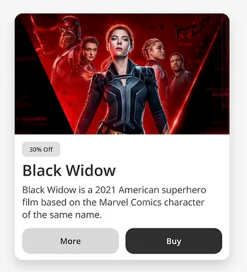
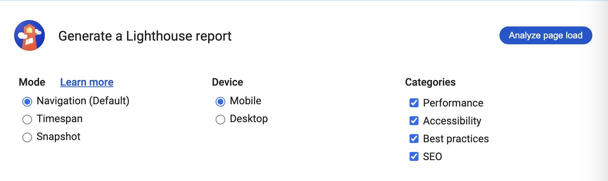

# Exercise 5: CSS Box Model and Best Practices

## Objectives
Practice working with the CSS box model to create some typical card layouts. Then strengthen your ability to analyze, think critically, and resolve coding issues and document your analysis in a simple 3 page website. Part 2 of this exercise is intended to help you revise the most important coding you've learnt so far.

## Instructions

### PART 1: Build three cards
**Tips:**
* Remember to make regular commits and pushes. **You will lose 30% of your grade if your commits don't document your progress**.
* Work in the folder called *part_1*. You don't need to edit any of the provided HTML in index.html to complete cards 1 and 2 but you may need to add links to Google Fonts in the head element. You will need to write some HTML for card 3.
* All styles for all 3 cards should be placed in the external stylesheet in the *part_1* folder
### Card 1:
   1. Clone your remote exercise repository onto your local machine.
   2. In VS Code, replace the image and the text with a photo of yourself and your details. 
   3. Apply the Google Font called Poppins to the body element. 
   4. Apply the 62.5% trick so that you can easily use the rem unit to define all your font sizes.
   5. Add the following CSS styles to the article element with the class name card-one:
     * Make the image round by using the border-radius property.
     * Give the card a background colour of `hsl(0, 0%, 100%)`.
     * Make the width of the card 500px.
     * Give the card a 50px margin on all four sides so that it isn't so close to the browser window's edges.
     * Give the card 30px of padding on all four sides so that the content doesn't touch the edges of the card.
     * Round the corners of the card by a 5px radius.
     * Give the card a top border that is 3px thick, solid in style and of the color `hsl(180, 62%, 55%)`.
     * Change the colour of the h2 to `hsl(234, 12%, 34%)` and make the text bolder.
     * Change hte colour of the p to `hsl(229, 6%, 66%)`.
     * Give the card a shadow. Go to https://getcssscan.com/css-box-shadow-examples to find a pleasing shadow.
 
 When you are finished the card should look like this:  
 

### Card 2:
The HTML is provided. Write the CSS. The background image is provided in the images folder. You can use Poppins and Fira Sans Condensed for the Google fonts (they are both static fonts). Be as exact as you can with your styling, pixel-perfect if possible. 

### Card 3:
Write the HTML and the CSS. The visual width of the card should be the same as card two. You can use the Open Sans variable Google font and the image is provided in the images folder. Note that the "30% off" text above the headline is not a link (you can't click on it), but the "More" and "Buy" text are links. Make sure to include the shadow.  

## PART 2: Analyze a website and document your findings
Perform a website performance test, research the results, and write an analysis. Then, build and style a simple 3-page website to showcase your findings. The exercise focuses equally on the quality of your content and of your coding.

_See examples of what your finished pages could look like in the repo's "part_2_examples" folder. Note that the exercise has been modified since these examples were created_

**Tips:** 
- Read all the part 2 instructions before starting.
- Remember to make regular commits and pushes. **You will lose 30% of your grade if your commits don't document your progress**.
- Fix the errors as they occur in your code and make the most of the tools available to you:
  1. Highlight errors. Note: If the debugger is not working then you may be in restricted mode and need to turn on Workspace Trust. Open the Command Palette (Ctrl+Shift+P or Cmd+Shift+P) then type and select "Workspaces: Manage Workspace Trust".
  2. Use the Prettier extension to help you format your code.
  3. Regularly save your files and check out what your web page looks like in a web browser as you code. Use the Chrome Developer Tools: Open index.html in Chrome, right-click > Inspect to help you troubleshoot problems.
  
### Step 1: Choose and test a website

Choose any website you like, and perform the two launch tasks below:

1. Go to https://wave.webaim.org and enter your chosen website's URL in the web address field to check the accessibility of the website. Check out all the accessibility errors and alerts in the Details tab. Take a screenshot and save it in the folder called images in your repo.
2. In Chrome, on the website's homepage, open the Developer Tools. Go to the Lighthouse tab, leave all settings as they are and click "Analyze page load". Take a screenshot of the results and save it in the folder called images in your repo.
   

### Step 2: Build a website to document the testing

Create a 3-page website from scratch, no HTML code has been provided. Make sure that your HTML is clean, error-free and **semantic** (don't use any div elements unless you absolutely have to)! Your website will include the following content:

**Page 1: Homepage:**

1. Header with navigation
2. Link to the website URL
3. Brief explanation of what the website is about and why you chose it
4. A screenshot of the homepage of the website that opens the full-size image of the homepage in a new browser tab when the user clicks on it
5. A card layout showing a summary of the test results with navigation links that take the visitor to the Accessibility and Lighthouse Report pages.
6. Footer

**Page 2: Accessibility:**

1. Header with navigation
2. Summary of accessibility findings
3. A screenshot of the homepage WAVE test results that opens the full-size image in a new browser tab when the user clicks on it
4. Pick 2 or three issues from the WAVE Report, research and explain what the problems are, why they matter, and how the issues can be fixed.
   - Pick issues that are not in the provided examples.
   - Be specific and make sure that your explanations are directy relevant to the website's code. You will need to examine the website's code with the Browser Developer Tools, quote the code if you can. Don't offer generic explanations that you copy and pasted from the internet. 
5. Footer

**Page 3: Lighthouse Report:**

1. Header with navigation
2. Summary of Lighthouse Report findings
3. A screenshot of the Lighthouse report that opens the full-size image in a new browser tab when the user clicks on it
4. Detailed explanations of the findings. Pick 2 or three issues from the Lighthouse Report, research and explain what the problems are, why they matter, and how the issues can be fixed.
   - You can also test your website with https://tools.pingdom.com/ as you might find that the results are easier to understand than the Lighthouse Performance Results.
   - Pick issues that are not in the provided examples.
   - Be specific and make sure that your explanations are directy relevant to the code. Don't offer generic explanations. You will need to examine the website's code with the Browser Developper Tools, quote the code if you can.
5. Footer

### Step 3: Style your website

Put some effort into styling your content and make it look well-structured and easy to read. All your CSS must be in one external stylesheet, it must be organized into sections using comments, and it must be efficient. Use class and descendant selectors to keep the CSS conflict-free. 

HTML Example:
~~~
 <section class="home_intro">
   <h2>Intro section heading</h2>
   
Intro section paragraph

   <a href="#">Anchor link</a>
   <a href="#" class="button_link">Button link</a>
</section> 
~~~

CSS Example:
~~~
** SITE-WIDE STYLES **
a {...}
.button_link {...}

** HOME PAGE STYLES **
.home_intro {...}
.home_intro h2 {...}
.home_intro p {...}
~~~

At the very least, you must include the following properties in your CSS:

- a Google font
- the 62.5% trick
- display properties: (inline, inline-block or block)
- box model properties: padding, margin, border, background, border-radius, box-shadow, width
- text formatting properties: font-family, font-weight, font-size, text-decoration, color
- a background image
- The content has to be centered on the page, regardless of the viewport width.

### Step 4: Format, add comments, and check for errors

- Use the Prettier VSCode extension to format HTML and CSS code.
- Add a few comments to explain your HTML and CSS code and highlight anything of interest.
- Validate each HTML page to make sure that it is correct: https://validator.w3.org/#validate_by_upload. Take screenshots of the results.
- Validate your CSS code to make sure that it is correct: https://jigsaw.w3.org/css-validator/ for CSS. Take a screenshot of the results.

**You have now completed your exercise but you still need to push your edits to GitHub and submit it in Brightspace. Make sure to follow the instructions in the How to Complete Your Exercises Guide.**