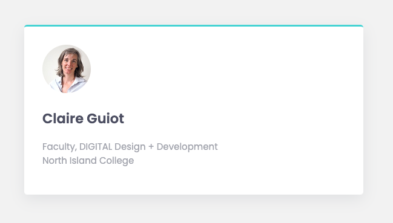
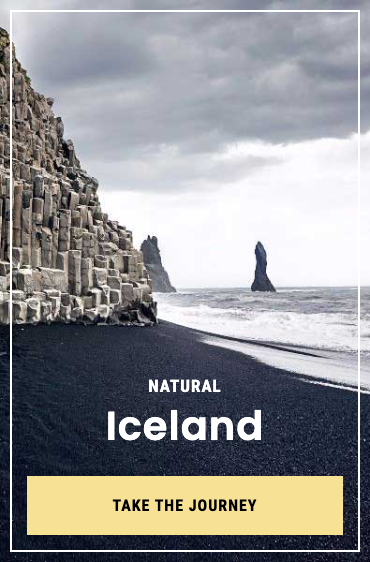
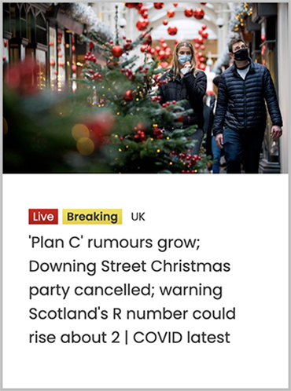

# Exercise 5: CSS Box Model

## Objectives
Practice working with the CSS box model to create some typical card layouts.

## Instructions
Remember to:
* Regularly save your files and check out what your web page looks like in a web browser.
* Make regular commits and pushes.

## Step 1: Get set up
* Clone your remote exercise repository onto your local machine.

## Step 2: Code the following 4 cards
* You don't need to edit any of the provided HTML content to complete this exercise. You may need to add links to Google Fonts in the head element.
* All styles should be placed in the external stylesheet.
### Card 1:
   * In VS Code, replace the image and the text with a photo of yourself and your details. 
   * Apply the Google Font called Poppins to the body element. 
   * Apply the 62.5% trick so that you can easily use the rem unit to define all your font sizes.
   * Then add the following CSS styles to the article element with the class name card-one:
     * Make the image round by using the border-radius property.
     * Give the card a background colour of `hsl(0, 0%, 100%)`.
     * Make the width of the card 500px.
     * Give the card a 50px margin on all four sides so that it isn't so close to the browser window's edges.
     * Give the card 30px of padding on all four sides so that the content doesn't touch the edges of the card.
     * Round the corners of the card by a 5px radius.
     * Give the card a top border that is 3px thick, solid in style and of the color `hsl(180, 62%, 55%)`.
     * Change the colour of the h2 to `hsl(234, 12%, 34%)` and make the text bolder.
     * Change hte colour of the p to `hsl(229, 6%, 66%)`.
     * Give the card a shadow. Go to https://getcssscan.com/css-box-shadow-examples to find a pleasing shadow.
 
 When you are finished the card should look like this:  
 

### Card 2:
The HTML is provided. Write the CSS. The background image is provided in the images folder. You can use Poppins and Fira Sans Condensed for the Google fonts (they are both static fonts). Be as exact as you can with your styling, pixel-perfect if possible. 

### Card 3:
Write the HTML and the CSS. The visual width of the card should be the same as card two. Try to use similar fonts (Google Fonts). You can source a similar image from a website such as https://www.unsplash.com or https://www.pexels.com. Note that the small text above the headline is not links or buttons (you're not meant to be able to click on them).  

### Card 4:
Design and code your own card. Read the best practices in this article to inform your design: https://uxplanet.org/ultimate-guide-for-designing-ui-cards-59488a91b44f (a PDF of the article is included in this repo). Both the design and the coding are graded. Your card needs to include:
* An image
* A heading
* A description
* A call-to-action

## Step 3: Format, organize and add comments 
* Use the Prettier VSCode extension to format your code.
* Add organizational CSS comments and order your style rules so that your CSS is easy to read.
* Add a few comments to explain your HTML and CSS code and highlight anything of interest.

## Step 4: Check for errors
* Use the VSCode HTMLHint extension and validate your HTML code to make sure that it is correct: https://validator.w3.org/#validate_by_upload. Take a screenshot of the results.
* Validate your CSS code to make sure that it is correct: https://jigsaw.w3.org/css-validator/ for CSS. Take a screenshot of the results.

**You have now completed your exercise but you still need to push your edits to GitHub and submit it in Brightspace. Make sure to follow the instructions in the How to Complete Your Exercises Guide.**